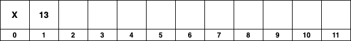

## Array Based Binary Trees - BST's in an Array

#### Due: N/A

### Introduction

Storing a binary tree in an array is a straightforward and efficient method when dealing with complete or almost complete binary trees, such as binary heaps. However, this method becomes less efficient for general binary search trees (BSTs) due to their potentially unbalanced nature.

### Overview

When storing a binary tree in an array, each element of the array corresponds to a node in the tree. The root of the tree is stored at the first index (often at index 1 for simplicity, leaving index 0 unused), and for any node stored at index `i`, you can calculate the positions of its children and parent using simple arithmetic:

- **Left Child**: Located at index `2 * i`.
- **Right Child**: Located at index `2 * i + 1`.
- **Parent**: Located at index `i / 2` (assuming integer division).

This storage method relies on the property that the tree is **complete** or almost complete, ensuring that there are no large gaps in the array.

### Real-World Usage

**Binary Heap** and **Heap Sort** are two instances when storing the binary tree in an array works ... why?? Because they abide by the property that the tree will alway be **complete**.

**However**: In practice, using an array to store a general BST is rare due to the potential for significant space inefficiency. A seriously unbalanced tree can lead to a situation where most of the array is empty, wasting memory.

### Justifiable Use Cases

However, there are specific scenarios where using an array to store a BST might be justifiable:

1. **Nearly Complete Trees**: In cases where the BST is guaranteed to be nearly complete, the space efficiency of the array storage can be acceptable.

2. **Static Trees**: For BSTs that are built once and do not change (no insertions or deletions), especially if they are nearly complete, using an array can provide fast, cache-friendly access to the nodes.

3. **Educational Purposes**: Teaching the concepts of binary trees, binary heaps, or illustrating the differences between various tree structures can sometimes benefit from the simplicity of array-based representation.

### Other Beneficial Uses for Array-based Binary Structures

Outside of heaps, there are a few other binary-structured data that might be efficiently stored in an array:

1. **Tournament Trees**: Used in sorting algorithms like Tournament Sort, where the tree structure is fixed and complete.

2. **Binary Indexed Trees (BITs) or Fenwick Trees**: Used for efficiently calculating prefix sums or cumulative frequencies. While not a binary tree in the traditional sense, it uses a binary structure conceptually stored in an array.

3. **Segment Trees**: Used for range query problems (like finding the minimum, maximum, sum, or greatest common divisor in a range). A segment tree is often stored in an array, especially when the tree is built once and is static. While segment trees can become unbalanced, they are generally structured in a way that limits the depth, making array storage feasible.

4. **Fixed-Depth Trees in Specific Applications**: In some domain-specific applications where the depth of the tree is known and limited, using an array can be an efficient choice.

In summary, while using an array to store a general BST is not common in the real world due to potential space inefficiencies with unbalanced trees, there are specific circumstances and types of binary-structured data where array-based storage can be beneficial. These scenarios typically involve trees that are either complete, nearly complete, or have a fixed structure that limits the depth and ensures efficient use of space.

### Array Based BST

#### Remember:

- Left Child = $2*i$
- Right Child = $2*i+1$
- Parent = $2/i$
- E.g Left and right child of index 5 are 10 and 11, and the parent of index 7 is 3.

## Walkthrough

Insert the following values into an array based BST: **$13, 7, 3, 17, 5, 11, 23$**

#### Empty Tree (array)

- Empty array for BST doesn't use the $0^{th}$ element.

#### Insert 13

- Place the first value at index 1 if it is empty.

#### Insert 7

- Index 1 is not empty, so compare 7 to 13 and determine it needs to go left (7 < 13) ($2 * 1 = 2$).
- Index 2 is empty, so we place the 7 there.

#### Insert 3

- Index 1 is not empty, so compare 3 to 13 and determine it needs to go left ($2 * 1 = 2$).
- Index 2 is not empty, so compare 3 to 7 and determine again to go left ($2 * 2 = 4$).
- Index 4 is empty, so we place the 3 there.

#### Insert 17

- Index 1 is not empty, so compare 17 to 13 and determine it needs to go right (17 > 13) ($2 * 1 + 1 = 3$).
- Index 3 is empty, so we place the 17 there.

#### Insert 5

- Index 1 is not empty, so compare 5 to 13 and determine it needs to go left ($2 * 1 = 2$).
- Index 2 is not empty, so compare 5 to 7 and determine again to go left ($2 * 2 = 4$).
- Index 4 is not empty, so compare 5 to 3 and determine to go right ($2 * 4 + 1 = 9$).
- Index 9 is empty, so we place the 5 there.

#### Insert 11

- Index 1 is not empty, so compare 11 to 13 and determine it needs to go left ($2 * 1 = 2$).
- Index 2 is not empty, so compare 11 to 7 and determine to go right ($2 * 2 + 1 = 5$).
- Index 5 is empty, so 11 gets placed there.

#### Insert 23

- Index 1 is not empty, so compare 23 to 13 and determine it needs to go right ($2 * 1 + 1 = 3$).
- Index 3 is not empty, so compare 23 to 17 and determine to go right ($2 * 3 + 1 = 7$).
- Index 7 is empty, so 23 gets placed there.

#### Tree Result

