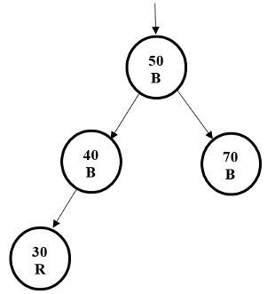

## Red-Black Rotation 

1.	Insert 85 into the tree below.  Rotate and/or adjust colors as necessary to maintain RB tree properties.  
	

1. 	Insert 65 into the tree below.  Rotate and/or adjust colors as necessary to maintain RB tree properties.  

3.	Insert 60 into the tree below.  Rotate and/or adjust colors as necessary to maintain RB tree properties.  

4. 	Insert 35 into the tree below.  Rotate and/or adjust colors as necessary to maintain RB tree properties.  

