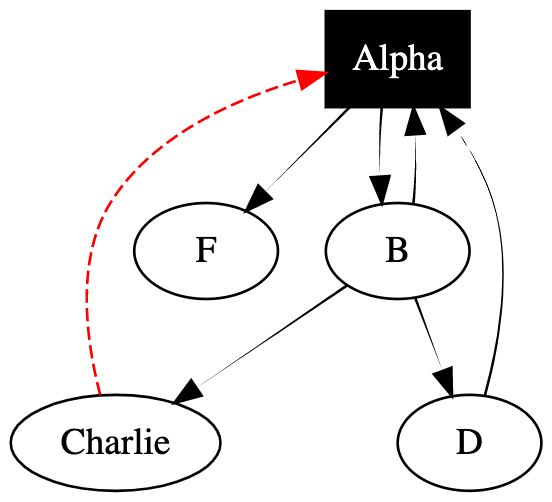

## Graphviz - Data Structures to Viewable Image


```cpp
#include "graphviz.hpp"

// https://graphviz.readthedocs.io/en/stable/manual.html
// https://dreampuf.github.io/GraphvizOnline/

using namespace std;


int main()
    GraphViz G;

    G.setEdgeStyle("tapered");

    G.addNode("A","Alpha");
    G.addNode("B");
    G.addNode("C","Charlie");
    G.addNode("D");

    G.addEdge("D","A");
    G.addEdge("C","A");
    G.addEdge("A","B");
    G.addEdge("B","C");
    G.addEdge("B","A");
    G.addEdge("B","D");
    G.addEdge("A","F");

    G.addNodeStyle("A","shape","box");
    G.addNodeStyle("A","style","filled");
    G.addNodeStyle("A","fontcolor","white");

    G.addEdgeStyle("C.A","color","red");
    G.addEdgeStyle("C.A","style","dashed");
    G.printNodes();

    //G.setFillNodes(true);

    cout<<G.getNeighbors("B")<<endl;
    cout<<G<<endl;
    return 0;
}
```

Creates:

```
digraph G {
	A  [color=black, fontcolor=white, id=A, label=Alpha, shape=box, style=filled, ];
	B  [color=black, id=B, label=B, shape=ellipse, style=solid, ];
	C  [color=black, id=C, label=Charlie, shape=ellipse, style=solid, ];
	D  [color=black, id=D, label=D, shape=ellipse, style=solid, ];
	F  [color=black, id=F, label=F, shape=ellipse, style=solid, ];
	D->A [color=black, style=tapered, ];
	C->A [color=red, style=dashed, ];
	A->B [color=black, style=tapered, ];
	B->C [color=black, style=tapered, ];
	B->A [color=black, style=tapered, ];
	B->D [color=black, style=tapered, ];
	A->F [color=black, style=tapered, ];
}
```

Which can then be turned into: 

